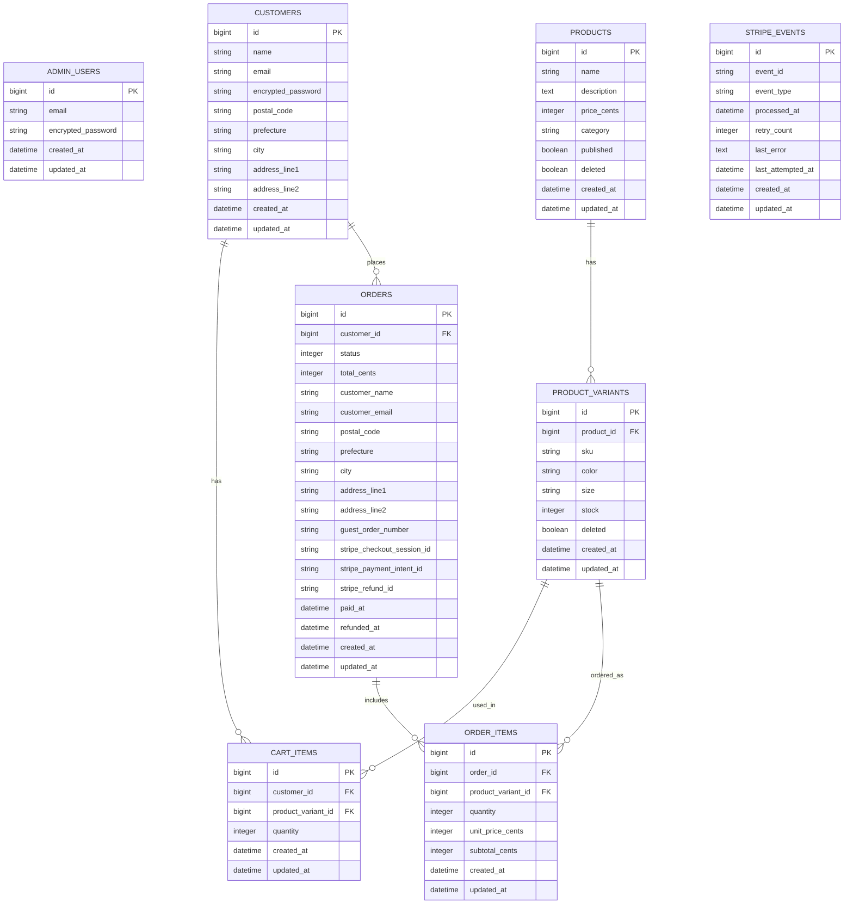

# VioletLotus EC Admin

## 1. Overview

- A single-store e-commerce application built with Ruby on Rails.
- This project is an **EC application with an admin panel**, designed for a single apparel store.
- The system focuses on **back-office operations**, including product management, inventory management, and order management.
- Both **guest checkout** and **registered user checkout** are supported.
- Demo: ----url
- [Figma - VioletLotus Admin](https://www.figma.com/design/FyMtVPAcQc0eArPW6eT7cV/EC%E3%82%B5%E3%82%A4%E3%83%88?node-id=0-1&t=r2dhyuTUfpk2hdAk-1)

### Admin Demo Login

- Email: admin@test.com
- Password: password

---

## 2. Design

### 2-1. Target Users

- **Admin**: store owner / inventory staff
- **Customer**: guest checkout or registered user

### 2-2. Checkout & Payment

- Cart-based checkout
- Payment: Stripe Checkout
- Currency: JPY (tax-inclusive pricing)
- Shipping fee: fixed amount

### 2-3. Guest vs Registered Checkout

- Guest checkout: allowed, but address is required at checkout
- Registered user: address is collected at sign-up and reused at checkout

### 2-4. Product Variants

- Variant dimensions: color / size
- Stock is managed per variant (SKU-level)

### 2-5. Admin Panel Design Principles

#### Purpose and Assumptions

- The system assumes an apparel EC site operated by a single store.
- The admin panel is used by **store owners and inventory staff** to manage products, inventory, and orders.
- The user-facing side allows customers to browse and purchase products (guest checkout supported).
- The layout is designed with a **1440px desktop frame width**.
- Since the admin interface contains more decision points, conditions, and navigation complexity, the **admin UI is prioritized in the design**.

#### Separation of Responsibilities (List / Detail / Edit)

- **List pages** handle exploration, overview, filtering, sorting, selecting items, and navigating to detail pages.
- **Detail/Edit pages** handle updates, deletions (soft delete), restoration, and other destructive operations.
- To prevent accidental operations, destructive actions are generally **not available directly from list views**.

#### Inventory Management

- Inventory is managed at the **variant (SKU) level** to distinguish color and size combinations.
- To reduce operational steps, there is **no separate edit page**.
Inventory can be updated through an **inline "Edit Mode" toggle in the list view**.
- When there are unsaved changes and the user attempts navigation, the system detects the changes and prompts for confirmation.
- **Automatic saving is intentionally avoided** to reduce the risk of unintended updates.
- Search, filtering, and sorting are implemented to support exploration in list views.

#### Order Management

- The order list supports **search, status filtering, date filtering, and sorting**.
- To prevent operational mistakes, **status updates can only be performed from the order detail page**.
- Status transitions are strictly defined to enforce **irreversible transition rules**.
- Orders **cannot be canceled once they reach the `shipped` state**.

#### Product Management

- To prevent accidental operations, **soft deletion is only available from the product edit page**.
- To preserve inventory and order history integrity, **soft delete + restore** is used instead of physical deletion.
- The trash view supports **search and sorting** for easier discovery.
- **Permanent deletion is not supported in the admin UI**.

#### Payment and Inventory Update

- **Stripe Checkout** is used as the external payment provider.
- Payment completion is confirmed via **Stripe Webhooks**.
- Inventory is decremented **only after payment confirmation**.
- If stock reaches **0**, the product variant is automatically shown as **SOLD OUT** in the user interface.

#### Documentation Policy

- `README`: high-level policies (design philosophy / major rules / core specifications)
- `docs/`: detailed specifications (API design / screen specifications / state transitions)

---

## 3. Domain Rules

### 3-1. Order Status State Machine

```text
pending → paid → processing → shipped → completed
paid → canceled
processing → canceled
```

Constraints:
- Orders **cannot be canceled after the `shipped` state**
- Status updates can only be performed from the **admin order detail page**
- `canceled` is allowed only from `paid` or `processing`
- Invalid status transitions are **rejected by the server**

### 3-2. Order Status & Transitions
#### Statuses
- pending
- paid
- processing
- shipped
- completed
- canceled
- failed
- refunded

#### Transition Flow
- pending → paid        （Stripe payment completed）
- pending → failed
- paid → processing     （admin operation）
- paid → canceled        (admin operation)
- processing → shipped  （admin operation）
- processing → canceled （admin operation）
- shipped → completed   （admin operation）

#### Forbidden Transitions:
- `shipped` or `completed` → `canceled`
- `completed` → `processing` or `shipped`
- `pending` → `canceled`
- Any undefined status transition

### 3-3. Inventory Constraints
- `stock >= 0` (negative values are not allowed)
- Inventory changes are allowed **only through admin edit mode**
- Inventory is decremented **after payment confirmation via webhook**
- If stock reaches **0**, the variant is shown as **SOLD OUT**

### 3-4. Product State
```text
active -> deleted
deleted -> active (restorable)
```

Constraints:
- Physical deletion is not performed (soft delete only)
- Deleted products appear in the **Trash view**
- Deleted products are **not visible on the storefront**

## 4. API Overview

- The API descriptions in this README represent **design-oriented specifications used to organize internal admin functionality**.
- Authentication uses **Devise session-based authentication**, not a public Bearer token API.

### 4-1. API Common Rules
- ALL timestamps are **ISO8601** format.
- The admin interface uses **Devise session authentication**
- Admin APIs assume an **authenticated admin session**
- Error response structure:
```json
{
  "error": "ERROR_CODE",
  "message": "Human-readable explanation"
}
```
- Pagination format:
```json
{
  "current_page": 1,
  "total_pages": 3
}
```

### 4-2. Endpoint List

| Group      | Method | Path                             | Summary               |
|-----------|--------|----------------------------------|------------------------|
| Products  | GET    | /admin/products                 | 商品一覧                 |
| Products  | GET    | /admin/products/:id             | 商品詳細（編集/プレビュー） |
| Products  | POST   | /admin/products                 | 商品作成                 |
| Products  | PUT    | /admin/products/:id             | 商品更新                 |
| Products  | PATCH  | /admin/products/:id/deleted     | 削除・復元トグル            |
| Trash     | GET    | /admin/trash/products           | 削除済み商品一覧             |
| Trash     | GET    | /admin/trash/products/:id       | 削除済み商品詳細             |
| Orders    | GET    | /admin/orders                   | 注文一覧                    |
| Orders    | GET    | /admin/orders/:id               | 注文詳細                    |
| Orders    | PATCH  | /admin/orders/:id/status        | 注文ステータス更新          |
| Inventory | GET    | /admin/inventories              | 在庫一覧（SKU単位）          |
| Inventory | PUT    | /admin/api/inventories          | 在庫一括更新                 |

## 5. API Details
### 5-1. Product APIs
#### GET /admin/products
概要:
- 商品一覧を取得する(検索・フィルタ・並び替え・含む)

認可:
- 管理者ログイン済みセッションが必要

### Headers: 
Content-Type: application/json

### Query Parameters:
 パラメータ  | 型     | 必須 | 説明 |
-----------|--------|-----|------|
 `q`      | string | 任意 | 商品名・説明の部分一致検索  |
 `status` | string | 任意 | all / published / unpublished |
 `sort`   | string | 任意 | updated_at_desc / updated_at_asc |
 `page`   | number | 任意 | ページ番号（１以上の整数）|

### Response 200:
```json
{
  "products": [
    {
      "id": "product-uuid",
      "name": "Tシャツ",
      "price": 2980,
      "thumbnail_url": "/images/products/xxx.jpg",
      "published": true,
      "updated_at": "2026-01-10T12:34:56Z"
    }
  ],
  "pagination": {
    "current": 1,
    "total_pages": 3
  }
}
```
### Status Codes:
- 200 OK: 成功
- 400 : 不正なクエリパラメータ
- 401 Unauthorized: 管理者として未ログイン、または認証無効

#### GET /admin/products/:id
概要:
- 商品の詳細を取得する（編集画面・プレビュー用）。

認可:
- 管理者ログイン済みセッションが必要

### Path Parameters:
 パラメータ | 型     | 必須 | 説明         |
 --------|--------|-----|--------------|
 id      | string | 必須 | 商品ID(UUID) |

### Response 200:
```json
{
  "id": "product-uuid",
  "name": "Tシャツ",
  "description": "商品説明テキスト",
  "category": "tops",
  "price": 2980,
  "image_url":  "/image/xxx.jpg",
  "published": true,
  "variants": [
    { "id": "variant-uuid-1", "color": "BLACK", "size": "M", "sku": "TSHIRT-BLK-M", "deleted": false }
  ]
}
```
### Status Codes:
- 200 OK: 成功
- 401 Unauthorized: 管理者として未ログイン、または認証無効
- 404 Not Found: 指定されたIDの商品が存在しない

#### POST /admin/products
概要:
- 商品を新規作成する。

認可:
- 管理者ログイン済みセッションが必要

### Headers:
Content-Type: application/json

### Request Body(JSON):
```json
{
  "name": "Tシャツ",
  "description": "商品説明テキスト",
  "category": "tops",
  "price": 2980,
  "image": "file-id-or-base64"
}
```
### Response 201:
```json
{
  "id": "product-uuid",
  "message": "商品を作成しました。"
}
```
### Status Codes:
- 201 Created: 作成成功
- 400 Bad Request: 必須項目不足・形式不正
- 401 Unauthorized: 管理者として未ログイン、または認証無効
- 422 Unprocessable Entity: バリデーションエラー


#### PUT /admin/products/:id
概要:
- 商品本体・基本情報・バリアントをまとめて編集する。

認可:
- 管理者ログイン済みセッションが必要

### Headers:
Content-Type: application/json

### Path Parameters:
 パラメータ  | 型    | 必須   | 説明          |
 ---------|-------|-------|--------------|
  id      | string | 必須 | 商品ID（UUID） |

### Request Body (JSON):
```json
{
  "name": "Tシャツ",
  "description": "商品説明テキスト",
  "category": "tops",
  "price": 2980,
  "image": "file-id-or-base64",
  "published": true,
  "variants": [
    {
      "id": "variant-uuid-1",
      "color": "BLACK",
      "size": "M",
      "sku": "TSHIRTS-BLK-S"
    },
    {
      "id": "variant-uuid-2",
      "color": "WHITE",
      "size": "L",
      "sku": "TSHIRT-BLK-M"
    }
  ]
}

```
### Response 200:
```json
{
  "id": "product-uuid",
  "message": "商品を更新しました。"
}
```
### Status Codes:
- 200 OK: 正常に更新された
- 400 Bad Request: JSON形成不正・必須項目不足
- 401 Unauthorized: 管理者として未ログイン、または認証無効
- 404 Not Found: 指定されたIDの商品が存在しない
- 422 Unprocessable Entity: バリデーションエラー（価格が負数など）

#### PATCH /admin/products/:id/deleted
概要:
- 商品の論理削除フラグをON/OFFする（削除・復元トグリ）。
- どの画面から呼んでも「deleted を true/false にするだけ」。

認可:
- 管理者ログイン済みセッションが必要

### Headers:
- Content-Type: application/json

### Path Parameters:
 パラメータ  | 型     | 必須  | 説明         |
 ---------|--------|------|--------------|
 id       | string | 必須 | 商品ID（UUID） |

### Request Body(JSON):
```json
{
  "deleted": true   //削除する場合は true, 復元する場合は false
}
```
### Response 200:
```json
{
  "id": "product-uuid",
  "message": "商品を削除しました。"
}
```
### Status Codes:
- 200 OK: 正常に更新された
- 400 Bad Request: JSON形式不正・必須項目不足
- 401 Unauthorized: 管理者として未ログイン、または認証無効
- 404 Not Found: 指定されたIDの商品が存在しない

#### GET /admin/trash/products
概要:
- `deleted = true` の商品だけを一覧取得する（検索・並び替えを含む）。

認可:
- 管理者ログイン済みセッションが必要

### Query Parameters:
 パラメータ | 型     | 必須 | 説明                              |
 --------|--------|------|-----------------------------------|
 q       | string | 任意 | 商品名での一部一致検索               |
 sort    | string | 任意 | deleted_at_desc / deleted_at_asc |
 page    | number | 任意 | ページ番号(１以上の整数)             |

### Response 200:
```json
{
  "products": [
    {
      "id": "uuid-1",
      "name": "Tシャツ",
      "published": true,
      "deleted_at": "2026-01-10T12:34:56Z"
    }
  ],
  "pagination": {
    "current_page": 1,
    "total_pages": 3
  }
}
```
### Status Codes:
- 200 OK: 成功
- 401 Unauthorized: 管理者として未ログイン、または認証無効
- 404 Not Found: ページ範囲外もしくは該当商品が存在しない

#### GET /admin/trash/products/:id
概要:
- `deleted = true` の商品詳細を取得する。
- `deleted = false`（すでに削除済み）の場合も 404 を返す。

認可:
- 管理者ログイン済みセッションが必要

### Path Parameters:
 パラメータ  | 型     | 必須 | 説明         |
 ---------|--------|-----|--------------|
 id       | string | 必須 | 商品ID(UUID) |

### Response 200:
```json
{
  "id": "product-uuid-1",
  "name": "Tシャツ",
  "description": "商品説明テキスト",
  "category": "tops",
  "price": 2980,
  "image_url": "/images/xxx.jpg",
  "deleted": true,
  "deleted_at": "2026-01-10T12:34:56Z",
  "variants": [
    { "variant_id": "v1", "color": "BLK", "size": "S", "stock": 10 },
    { "variant_id": "v2", "color": "WHT", "size": "M", "stock": 5 }
  ]
}
```
### Status Codes:
- 200 OK: 成功
- 401 Unauthorized: 管理者として未ログイン、または認証無効
- 404 Not Found: 対象IDが存在しない、または削除されていない

### 5-2. Order APIs
#### GET /admin/orders
概要:
- 注文一覧を取得する（検索、フィルター、並び替えを含む）。

認可:
- 管理者ログイン済みセッションが必要

### Query Parameters:
 パラメータ     | 型 | 必須    | 説明                                |
 ------------|----|---------|------------------------------------|
 q           | string | 任意　 　| 注文番号、顧客名、メールアドレスでの一部一致検索 |
 status      | string | 任意    | pending / paid / processing / shipped / completed / canceled / failed / refunded |
 from        | string | 任意    | 開始日（YYYY-MM-DD）                 |
 to          | string | 任意    | 終了日（YYYY-MM-DD）                 |
 sort        | string | 任意    | created_at_desc　/ created_at_asc（注文日時の降順/昇順）　|
 page        | number | 任意    | ページ番号（１以上の整数）              |
 
### Response 200:
```json
{
  "orders": [
    {
      "id": "order-uuid",
      "order_number": "20260110-001",
      "created_at": "2026-01-10T12:34:56Z",
      "customer_type": "guest",
      "customer_email": "user@example.com",
      "customer_name": "Tanaka Taro",
      "status": "paid",
      "payment_method": "credit",
      "item_count": 2,
      "total_amount": 2980
    }
  ],
  "pagination": {
    "current": 1,
    "total_pages": 3
  }
}
```
### Status Codes:
- 200 OK: 成功
- 401 Unauthorized: 管理者として未ログイン、または認証無効

#### GET /admin/orders/:id
概要:
- 注文の詳細を取得する（注文情報＋注文に含まれる商品一覧）。

認可:
- 管理者ログイン済みセッションが必要

### Path Parameters:
 パラメータ  | 型     | 必須 |  説明         |
 ---------|--------|------|---------------|
 id       | string | 必須 | 注文ID（UUID） |
### Response 200:
```json
{
  "id": "order-uuid",
  "order_number": "20260110-001",

  "status": "processing",
  "payment_method": "credit",
  "total_amount": 2980,
  "item_count": 2,

  "created_at": "2026-01-10T12:34:56Z",
  "paid_at": "2026-01-10T12:34:56Z",
  "shipped_at": null,
  "completed_at": null,
  "canceled_at": null,

  "customer": {
    "type": "guest",
    "name": "Tanaka Taro",
    "email": "user@example.com",
    "postal_code": "XX県",
    "prefecture": "XX市",
    "city": "XX町",
    "address_line1": "XXX-XX",
    "address_line2": "XXXマンション XXX"
  },

  "order_items": [
    {
      "product_id": "product-uuid-1",
      "product_name": "Tシャツ",
      "color": "BLK",
      "size": "S",
      "quantity": 2,
      "unit_price": 1490,
      "subtotal": 2980
    }
  ]
}
```
### Status Codes:
- 200 OK: 成功
- 401 Unauthorized: 管理者として未ログイン、または認証無効
- 404 Not Found: 指定されたIDの注文が存在しない

#### PATCH /admin/orders/:id/status
概要:
- 注文ステータスを更新する。
- 定義された遷移ルールに従い、不正な遷移は拒否する。

認可:
- 管理者ログイン済みセッションが必要

### Headers:
- Content-Type: application/json

### Request Body (Json):
```json
{
  "status": "shipped"
}
```
### Response 200:
```json
{
  "id": "order-uuid",
  "message": "ステータスを更新しました。"
}
```
### Status Codes:
- 200 OK: 正常に更新された
- 400 Bad Request: statusが欠落・定義外の値
- 401 Unauthorized: 管理者として未ログイン、または認証無効
- 404 Not Found: 注文が存在しない
- 422 Unprocessable Entity:
 - Order Status & Transitions に反する遷移を要求した場合
 - 例: shipped/completed の注文に "canceled"を指定した場合

### 5-3. Inventory APIs
#### GET /admin/inventories
概要:
- バリアント（SKU）単位の在庫一覧を取得する（検索・フィルター・並び替えを含む）。

認可:
- 管理者ログイン済みセッションが必要

### Query Parameters:
 パラメータ     | 型     | 必須  | 説明                                             |
 ------------|--------|------|--------------------------------------------------|
 q           | string | 任意 | 商品名 / カラー / サイズ / SKU の部分一致検索          |
 stock_state | string | 任意 | all / in_stock / low / out_of_stock              |
 sort        | string | 任意 | updated_at_desc / stock_desc / stock_asc(在庫数の降順/昇順) |
 page        | number | 任意 | ページ番号（１以上の整数）                            |

### Response 200:
```json
{
  "variants": [
    {
      "id": "variant-uuid",
      "product_name": "Tシャツ",
      "color": "BLK",
      "size": "S",
      "stock": 10,
      "updated_at": "2026-01-10T12:34:56Z"
    }
  ],
  "pagination": {
    "current_page": 1,
    "total_pages": 3
  }
}
```
### Status Codes:
- 200 OK: 成功
- 401 Unauthorized: 管理者として未ログイン、または認証無効

#### PUT /admin/api/inventories
概要:
- 編集モード ON 中に変更された全ての在庫を一括更新する。

認可:
- 管理者ログイン済みセッションが必要

### Headers:
- Content-Type: application/json

### Request Body (JSON):
```json
{
  "variants": [
    {
      "id": "variant-uuid-1",
      "stock": 15
    },
    {
      "id": "variant-uuid-2",
      "stock": 0
    }
  ]
}
```
### Response 200:
```json
{
  "updated_count": 2,
  "message": "在庫を更新しました。"
}
```
### Status Codes:
- 200 OK: 正常に更新された
- 400 Bad Request: JSON形式が不正
- 401 Unauthorized: 管理者として未ログイン、または認証無効
- 422 Unprocessable Entity: 在庫数が負数などのバリデーション違反

### 5-4. Error Codes:
- BAD_REQUEST            / JSONフォーマット不正、クエリ不正
- UNAUTHORIZED           / 管理者として未ログイン、または認証無効
- INVALID_CREDENTIALS    / ログイン失敗
- INVALID_TOKEN          / パスワードリセットなどの token 不正
- NOT_FOUND              / リソースが存在しない
- VALIDATION_ERROR       / バリデーション違反
- CONFLICT               / 整合性エラー・復元不可など

## 6. Setup
### 6-1. Tech Stack
- Ruby 3.2.2
- Ruby on Rails 7.1
- PostgreSQL
- Stripe Checkout/Webhook
- CSS / JavaScript
- Render (deployment)

### 6-2. Local Setup
```bash
bundle install
rails db:create
rails db:migrate
rails s
```

## Detailed Setup
```bash
git clone <your-repo-url>
cd shop-app
bundle install
rails db:create
rails db:migrate
bin/dev
```
## 7. ER Diagram

- Guest carts are managed **via session storage rather than database tables.**
- The `stripe_events` table is used to ensure **idempotency and retry control for Stripe webhook processing.**


