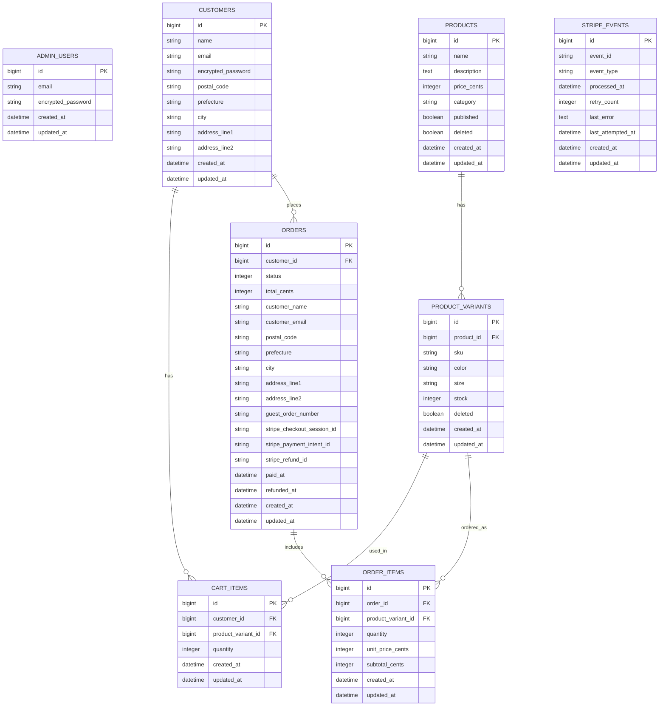

# VioletLotus EC Admin

## 1. Overview

- A single-store e-commerce application built with Ruby on Rails.
- This project is an **EC application with an admin panel**, designed for a single apparel store.
- The system focuses on **back-office operations**, including product management, inventory management, and order management.
- Both **guest checkout** and **registered user checkout** are supported.
- Demo: (https://violetlotus-ec.onrender.com)
- [Figma - VioletLotus Admin](https://www.figma.com/design/FyMtVPAcQc0eArPW6eT7cV/EC%E3%82%B5%E3%82%A4%E3%83%88?node-id=0-1&t=r2dhyuTUfpk2hdAk-1)

### Admin Demo Login

- Email: admin@test.com
- Password: password

---

## 2. Design

### 2-1. Target Users

- **Admin**: store owner / inventory staff
- **Customer**: guest checkout or registered user

### 2-2. Checkout & Payment

- Cart-based checkout
- Payment: Stripe Checkout
- Currency: JPY (tax-inclusive pricing)
- Shipping fee: fixed amount

### 2-3. Guest vs Registered Checkout

- Guest checkout: allowed, but address is required at checkout
- Registered user: address is collected at sign-up and reused at checkout

### 2-4. Product Variants

- Variant dimensions: color / size
- Stock is managed per variant (SKU-level)

### 2-5. Admin Panel Design Principles

#### Purpose and Assumptions

- The system assumes an apparel EC site operated by a single store.
- The admin panel is used by **store owners and inventory staff** to manage products, inventory, and orders.
- The user-facing side allows customers to browse and purchase products (guest checkout supported).
- The layout is designed with a **1440px desktop frame width**.
- Since the admin interface contains more decision points, conditions, and navigation complexity, the **admin UI is prioritized in the design**.

#### Separation of Responsibilities (List / Detail / Edit)

- **List pages** handle exploration, overview, filtering, sorting, selecting items, and navigating to detail pages.
- **Detail/Edit pages** handle updates, deletions (soft delete), restoration, and other destructive operations.
- To prevent accidental operations, destructive actions are generally **not available directly from list views**.

#### Inventory Management

- Inventory is managed at the **variant (SKU) level** to distinguish color and size combinations.
- To reduce operational steps, there is **no separate edit page**. Inventory can be updated through an **inline "Edit Mode" toggle in the list view**.
- When there are unsaved changes and the user attempts navigation, the system detects the changes and prompts for confirmation.
- **Automatic saving is intentionally avoided** to reduce the risk of unintended updates.
- Search, filtering, and sorting are implemented to support exploration in list views.

#### Order Management

- The order list supports **search, status filtering, date filtering, and sorting**.
- To prevent operational mistakes, **status updates can only be performed from the order detail page**.
- Status transitions are strictly defined to enforce **irreversible transition rules**.
- Orders **cannot be canceled once they reach the `shipped` state**.

#### Product Management

- To prevent accidental operations, **soft deletion is only available from the product edit page**.
- To preserve inventory and order history integrity, **soft delete + restore** is used instead of physical deletion.
- The trash view supports **search and sorting** for easier discovery.
- **Permanent deletion is not supported in the admin UI**.

#### Payment and Inventory Update

- **Stripe Checkout** is used as the external payment provider.
- Payment completion is confirmed via **Stripe Webhooks**.
- Inventory is decremented **only after payment confirmation**.
- If stock reaches **0**, the product variant is automatically shown as **SOLD OUT** in the user interface.

#### Documentation Policy

- `README`: high-level policies (design philosophy / major rules / core specifications)
- `docs/`: detailed specifications (API design / screen specifications / state transitions)

---

## 3. Domain Rules

### 3-1. Order Status State Machine

```text
pending → paid → processing → shipped → completed
paid → canceled
processing → canceled
```

Constraints:
- Orders **cannot be canceled after the `shipped` state**
- Status updates can only be performed from the **admin order detail page**
- `canceled` is allowed only from `paid` or `processing`
- Invalid status transitions are **rejected by the server**

### 3-2. Order Status & Transitions
#### Statuses
- pending
- paid
- processing
- shipped
- completed
- canceled
- failed
- refunded

#### Transition Flow
- pending → paid (Stripe payment completed)
- pending → failed
- paid → processing (admin operation)
- paid → canceled (admin operation)
- processing → shipped (admin operation)
- processing → canceled (admin operation)
- shipped → completed (admin operation)

#### Forbidden Transitions:
- `shipped` or `completed` → `canceled`
- `completed` → `processing` or `shipped`
- `pending` → `canceled`
- Any undefined status transition

### 3-3. Inventory Constraints
- `stock >= 0` (negative values are not allowed)
- Inventory changes are allowed **only through admin edit mode**
- Inventory is decremented **after payment confirmation via webhook**
- If stock reaches **0**, the variant is shown as **SOLD OUT**

### 3-4. Product State
```text
active -> deleted
deleted -> active (restorable)
```

Constraints:
- Physical deletion is not performed (soft delete only)
- Deleted products appear in the **Trash view**
- Deleted products are **not visible on the storefront**

## 4. API Overview

- The API descriptions in this README represent **design-oriented specifications used to organize internal admin functionality**.
- Authentication uses **Devise session-based authentication**, not a public Bearer token API.

### 4-1. API Common Rules
- ALL timestamps are **ISO8601** format.
- The admin interface uses **Devise session authentication**
- Admin APIs assume an **authenticated admin session**
- Error response structure:
```json
{
  "error": "ERROR_CODE",
  "message": "Human-readable explanation"
}
```
- Pagination format:
```json
{
  "current_page": 1,
  "total_pages": 3
}
```

### 4-2. Endpoint List

| Group      | Method | Path                             | Summary               |
|-----------|--------|----------------------------------|------------------------|
| Products  | GET    | /admin/products                 | Product list            |
| Products  | GET    | /admin/products/:id             | Product detail (edit / preview) |
| Products  | POST   | /admin/products                 | Create product           |
| Products  | PUT    | /admin/products/:id             | Update product           |
| Products  | PATCH  | /admin/products/:id/deleted     | Toggle delete / restore   |
| Trash     | GET    | /admin/trash/products           | Deleted product list      |
| Trash     | GET    | /admin/trash/products/:id       | Deleted product detail    |
| Orders    | GET    | /admin/orders                   | Order list                |
| Orders    | GET    | /admin/orders/:id               | Order detail              |
| Orders    | PATCH  | /admin/orders/:id/status        | Update order status       |
| Inventory | GET    | /admin/inventories              | Inventory list (SKU-level)|
| Inventory | PUT    | /admin/api/inventories          | Bulk inventory update     |

## 5. API Details
### 5-1. Product APIs
#### GET /admin/products
Overview:
- Retrieve a list of products (including search, filtering, and sorting).

Authorization:
- Requires an authenticated admin session.

### Headers: 
Content-Type: application/json

### Query Parameters:
Parameter | Type 　　　　| Required | Description                      |
----------|--------|----------|----------------------------------|
 `q`      | string | optional | Partial match search for product name or description |
 `status` | string | optional | all / published / unpublished    |
 `sort`   | string | optional | updated_at_desc / updated_at_asc |
 `page`   | number | optional | Page number (integer ≥ 1)        |

### Response 200:
```json
{
  "products": [
    {
      "id": "product-uuid",
      "name": "T-shirt",
      "price": 2980,
      "thumbnail_url": "/images/products/xxx.jpg",
      "published": true,
      "updated_at": "2026-01-10T12:34:56Z"
    }
  ],
  "pagination": {
    "current": 1,
    "total_pages": 3
  }
}
```
### Status Codes:
- 200 OK: Success
- 400 Bad Request: Invalid query parameters
- 401 Unauthorized: Not logged in as admin or invalid authentication

#### GET /admin/products/:id
Overview:
- Retrieve product details (used for the edit screen and preview).

Authorization:
- Requires an authenticated admin session.

### Path Parameters:
 Parameter | Type   | Required | Description       |
 ----------|--------|----------|-------------------|
 id        | string | required | Product ID (UUID) |

### Response 200:
```json
{
  "id": "product-uuid",
  "name": "T-shirt",
  "description": "Product description text",
  "category": "tops",
  "price": 2980,
  "image_url":  "/image/xxx.jpg",
  "published": true,
  "variants": [
    { "id": "variant-uuid-1", "color": "BLACK", "size": "M", "sku": "TSHIRT-BLK-M", "deleted": false }
  ]
}
```
### Status Codes:
- 200 OK: Success
- 401 Unauthorized: Not logged in as admin or invalid authentication
- 404 Not Found: Product with the specified ID does not exist

#### POST /admin/products
Overview:
- Create a new product.

Authorization:
- Requires an authenticated admin session.

### Headers:
Content-Type: application/json

### Request Body(JSON):
```json
{
  "name": "T-shirt",
  "description": "Product description text",
  "category": "tops",
  "price": 2980,
  "image": "file-id-or-base64"
}
```
### Response 201:
```json
{
  "id": "product-uuid",
  "message": "Product created successfully."
}
```
### Status Codes:
- 201 Created: Successfully created
- 400 Bad Request: Missing required fields or invalid format
- 401 Unauthorized: Not logged in as admin or invalid authentication
- 422 Unprocessable Entity: Validation error

#### PUT /admin/products/:id
Overview:
- Update the product, including its basic information and variants.

Authorization:
- Requires an authenticated admin session.

### Headers:
Content-Type: application/json

### Path Parameters:
 Parameter | Type   | Required | Description       |
 ----------|--------|----------|-------------------|
  id       | string | required | Product ID (UUID) |

### Request Body (JSON):
```json
{
  "name": "T-shirt",
  "description": "Product description text",
  "category": "tops",
  "price": 2980,
  "image": "file-id-or-base64",
  "published": true,
  "variants": [
    {
      "id": "variant-uuid-1",
      "color": "BLACK",
      "size": "M",
      "sku": "TSHIRTS-BLK-S"
    },
    {
      "id": "variant-uuid-2",
      "color": "WHITE",
      "size": "L",
      "sku": "TSHIRT-BLK-M"
    }
  ]
}

```
### Response 200:
```json
{
  "id": "product-uuid",
  "message": "Product updated successfully."
}
```
### Status Codes:
- 200 OK: Successfully updated
- 400 Bad Request: Invalid JSON format or missing required fields
- 401 Unauthorized: Not logged in as admin or invalid authentication
- 404 Not Found: Product with the specified ID does not exist
- 422 Unprocessable Entity: Validation error (e.g., negative price)

#### PATCH /admin/products/:id/deleted
Overview:
- Toggle the product logical deletion flag (delete / restore).
- From any screen, this endpoint simply sets `deleted` to true or false.

Authorization:
- Requires an authenticated admin session.

### Headers:
- Content-Type: application/json

### Path Parameters:
 Parameter  | Type   | Required | Description       |
 -----------|--------|----------|-------------------|
 id         | string | required | Product ID (UUID) |

### Request Body(JSON):
```json
{
  "deleted": true
}
```
- `true`=delete
- `false`=restore
### Response 200:
```json
{
  "id": "product-uuid",
  "message": "Product deleted successfully."
}
```
### Status Codes:
- 200 OK: Successfully updated
- 400 Bad Request: Invalid JSON format or missing required fields
- 401 Unauthorized: Not logged in as admin or invalid authentication
- 404 Not Found: Product with the specified ID does not exist

#### GET /admin/trash/products
Overview:
- Retrieve only products where `deleted = true` (including search and sorting).

Authorization:
- Requires an authenticated admin session.

### Query Parameters:
 Parameter | Type   | Required | Description                          |
 ----------|--------|----------|--------------------------------------|
 q         | string | optional | Partial match search by product name |
 sort      | string | optional | deleted_at_desc / deleted_at_asc     |
 page      | number | optional | Page number (integer ≥ 1)            |

### Response 200:
```json
{
  "products": [
    {
      "id": "uuid-1",
      "name": "T-shirt",
      "published": true,
      "deleted_at": "2026-01-10T12:34:56Z"
    }
  ],
  "pagination": {
    "current_page": 1,
    "total_pages": 3
  }
}
```
### Status Codes:
- 200 OK: Success
- 401 Unauthorized: Not logged in as admin or invalid authentication
- 404 Not Found: Page out of range or no matching products

#### GET /admin/trash/products/:id
Overview:
- Retrieve details of a product where `deleted = true`.
- If `deleted = false`, the API also returns 404.

Authorization:
- Requires an authenticated admin session.

### Path Parameters:
 Parameter | Type   | Required | Description       |
 ----------|--------|----------|-------------------|
 id        | string | required | Product ID (UUID) |

### Response 200:
```json
{
  "id": "product-uuid-1",
  "name": "T-shirt",
  "description": "Product description text",
  "category": "tops",
  "price": 2980,
  "image_url": "/images/xxx.jpg",
  "deleted": true,
  "deleted_at": "2026-01-10T12:34:56Z",
  "variants": [
    { "variant_id": "v1", "color": "BLK", "size": "S", "stock": 10 },
    { "variant_id": "v2", "color": "WHT", "size": "M", "stock": 5 }
  ]
}
```
### Status Codes:
- 200 OK: Success
- 401 Unauthorized: Not logged in as admin or invalid authentication
- 404 Not Found: Target ID does not exist or the product is not deleted

### 5-2. Order APIs
#### GET /admin/orders
Overview:
- Retrieve the order list (including search, filtering, and sorting).

Authorization:
- Requires an authenticated admin session.

### Query Parameters:
 Parameter   | Type   | Required    | Description                                |
 ------------|--------|-------------|--------------------------------------------|
 q           | string | optional　 　| Partial match search by order number, customer name, or email |
 status      | string | optional    | pending / paid / processing / shipped / completed / canceled / failed / refunded |
 from        | string | optional    | Start date (YYYY-MM-DD)                |
 to          | string | optional    | End date (YYYY-MM-DD)                  |
 sort        | string | optional    | created_at_desc / created_at_asc　     |
 page        | number | optional    | Page number (integer ≥ 1)              |
 
### Response 200:
```json
{
  "orders": [
    {
      "id": "order-uuid",
      "order_number": "20260110-001",
      "created_at": "2026-01-10T12:34:56Z",
      "customer_type": "guest",
      "customer_email": "user@example.com",
      "customer_name": "Tanaka Taro",
      "status": "paid",
      "payment_method": "credit",
      "item_count": 2,
      "total_amount": 2980
    }
  ],
  "pagination": {
    "current": 1,
    "total_pages": 3
  }
}
```
### Status Codes:
- 200 OK: Success
- 401 Unauthorized: Not logged in as admin or invalid authentication

#### GET /admin/orders/:id
Overview:
- Retrieve order details (order information + items included in the order).

Authorization:
- Requires an authenticated admin session.

### Path Parameters:
 Parameter | Type   | Required | Description     |
 ----------|--------|----------|-----------------|
 id        | string | required | Order ID (UUID) |
### Response 200:
```json
{
  "id": "order-uuid",
  "order_number": "20260110-001",

  "status": "processing",
  "payment_method": "credit",
  "total_amount": 2980,
  "item_count": 2,

  "created_at": "2026-01-10T12:34:56Z",
  "paid_at": "2026-01-10T12:34:56Z",
  "shipped_at": null,
  "completed_at": null,
  "canceled_at": null,

  "customer": {
    "type": "guest",
    "name": "Tanaka Taro",
    "email": "user@example.com",
    "postal_code": "123-4567",
    "prefecture": "Tokyo",
    "city": "Shibuya",
    "address_line1": "1-2-3 Jingumae",
    "address_line2": "ABC Mansion 101"
  },

  "order_items": [
    {
      "product_id": "product-uuid-1",
      "product_name": "T-shirt",
      "color": "BLK",
      "size": "S",
      "quantity": 2,
      "unit_price": 1490,
      "subtotal": 2980
    }
  ]
}
```
### Status Codes:
- 200 OK: Success
- 401 Unauthorized: Not logged in as admin or invalid authentication
- 404 Not Found: Order with the specified ID does not exist

#### PATCH /admin/orders/:id/status
Overview:
- Update the order status.
- Invalid transitions are rejected according to the defined state transition rules.

Authorization:
- Requires an authenticated admin session.

### Headers:
- Content-Type: application/json

### Request Body (Json):
```json
{
  "status": "shipped"
}
```
### Response 200:
```json
{
  "id": "order-uuid",
  "message": "Order status updated successfully."
}
```
### Status Codes:
- 200 OK: Updated successfully
- 400 Bad Request: Missing status or invalid value
- 401 Unauthorized: Admin is not logged in or authentication is invalid
- 404 Not Found: The order does not exist
- 422 Unprocessable Entity:
 - Requested transition violates the defined order status rules
 - Example: specifying `canceled` for an order already in `shipped` or `completed`

### 5-3. Inventory APIs
#### GET /admin/inventories
Overview:
- Retrieves the inventory list at the variant (SKU) level, including search, filtering, sorting, and pagination.

Authorization:
- Requires an authenticated admin session.

### Query Parameters:
 Parameter   | Type   | Required | Description                                  |
 ------------|--------|----------|----------------------------------------------|
 q           | string | Optional | Partial match search by product name, color, size, or SKU |
 stock_state | string | Optional | all / in_stock / low / out_of_stock              |
 sort        | string | Optional | updated_at_desc / stock_desc / stock_asc         |
 page        | number | Optional | Page number (integer greater than or equal to 1) |

### Response 200:
```json
{
  "variants": [
    {
      "id": "variant-uuid",
      "product_name": "T-shirt",
      "color": "BLK",
      "size": "S",
      "stock": 10,
      "updated_at": "2026-01-10T12:34:56Z"
    }
  ],
  "pagination": {
    "current_page": 1,
    "total_pages": 3
  }
}
```
### Status Codes:
- 200 OK: Success
- 401 Unauthorized: Admin is not logged in or authentication is invalid

#### PUT /admin/api/inventories
Overview:
- Bulk updates all inventory rows modified while edit mode is enabled.

Authorization:
- Requires an authenticated admin session.

### Headers:
- Content-Type: application/json

### Request Body (JSON):
```json
{
  "variants": [
    {
      "id": "variant-uuid-1",
      "stock": 15
    },
    {
      "id": "variant-uuid-2",
      "stock": 0
    }
  ]
}
```
### Response 200:
```json
{
  "updated_count": 2,
  "message": "Inventory updated successfully."
}
```
### Status Codes:
- 200 OK: Updated successfully
- 400 Bad Request: Invalid JSON format
- 401 Unauthorized: Admin is not logged in or authentication is invalid
- 422 Unprocessable Entity: Validation error, such as negative stock values

### 5-4. Error Codes:
- BAD_REQUEST / Invalid JSON format or invalid query parameters
- UNAUTHORIZED / Admin is not logged in or authentication is invalid
- INVALID_CREDENTIALS / Login failed
- INVALID_TOKEN / Invalid token, such as for password reset
- NOT_FOUND / Resource does not exist
- VALIDATION_ERROR / Validation failed
- CONFLICT / Consistency error or non-restorable state

## 6. Setup
### 6-1. Tech Stack
- Ruby 3.2.2
- Ruby on Rails 7.1
- PostgreSQL
- Stripe Checkout/Webhook
- CSS / JavaScript
- Render (deployment)

### 6-2. Local Setup
```bash
bundle install
rails db:create
rails db:migrate
rails s
```

## Detailed Setup
```bash
git clone <your-repo-url>
cd shop-app
bundle install
rails db:create
rails db:migrate
bin/dev
```
## 7. ER Diagram

- Guest carts are managed **via session storage rather than database tables.**
- The `stripe_events` table is used to ensure **idempotency and retry control for Stripe webhook processing.**



## 8. Demo Payment (Stripe Test)

This application uses Stripe in test mode.

Use the following test card when checking out.

- Card number: 4242 4242 4242 4242
- Expiration date: Any future date
- CVC: Any 3 digits
- ZIP: Any value
